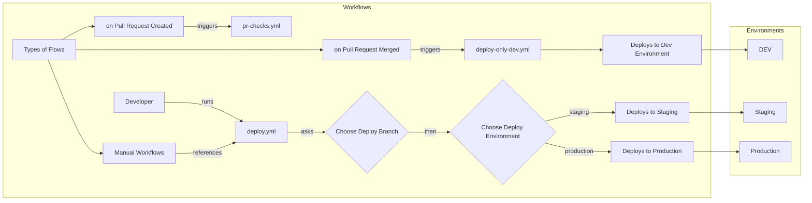

# Collection of Reusable Workflows

## Ideal Setup



```mermaid
graph LR
    subgraph Environments
        ENV_DEV["DEV"]
        ENV_STAGING["Staging"]
        ENV_PRODUCTION["Production"]
    end
    subgraph PR_CHECKS[Workflows]
        TYPES_OF_FLOWS["Types of Flows"]
        TYPES_OF_FLOWS --> PR_CREATED_FLOW["on Pull Request Created"]
        TYPES_OF_FLOWS --> PR_MERGED_FLOW["on Pull Request Merged"]
        TYPES_OF_FLOWS --> RELEASE_CREATED_FLOW["on Release Created"]
        TYPES_OF_FLOWS --> MANUAL_FLOW[Manual Workflows]

        PR_CREATED_FLOW --triggers--> YAML_PR_CHECKS[pr-checks.yml]
        PR_MERGED_FLOW  --triggers--> YAML_DEPLOY_DEV_ONLY[deploy-only-dev.yml] --> DEPLOY_DEV[Deploys to Dev Environment] --> ENV_DEV
        
        Developer --runs--> YAML_DEPLOY[deploy.yml]
        MANUAL_FLOW -- references --> YAML_DEPLOY
        YAML_DEPLOY -- asks --> CHOOSE_DEPLOY_BRANCH{"Choose Deploy Branch"}
        CHOOSE_DEPLOY_BRANCH --then--> CHOOSE_DEPLOY_ENVIRONMENT{"Choose Deploy Environment"}
        CHOOSE_DEPLOY_ENVIRONMENT --staging--> DEPLOY_TO_STAGING["Deploys to Staging"] --> ENV_STAGING
        CHOOSE_DEPLOY_ENVIRONMENT --production--> DEPLOY_TO_PRODUCTION["Deploys to Production"] --> ENV_PRODUCTION
        
        Developer --creates--> Release -- 
    end

```