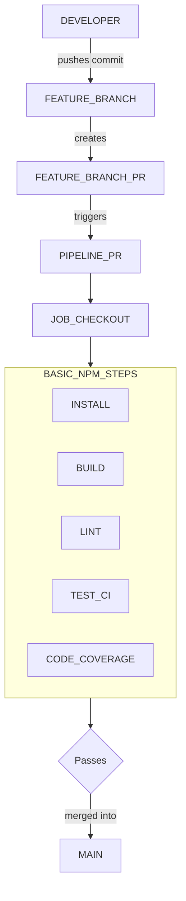
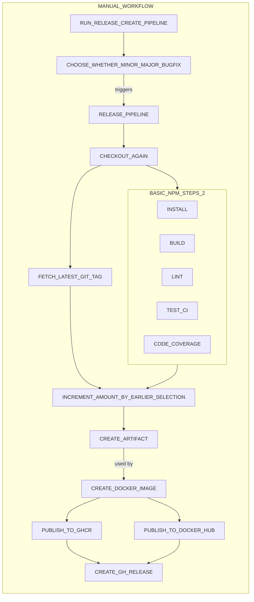
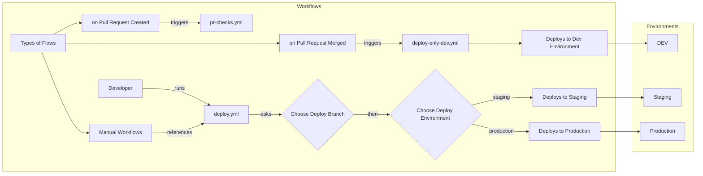
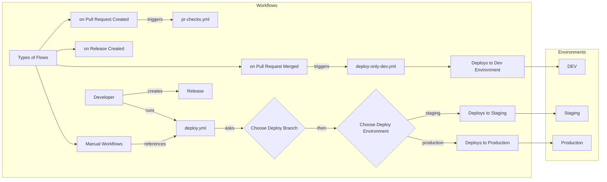

# Collection of Reusable Workflows

* [List of Github Variables](https://docs.github.com/en/actions/writing-workflows/choosing-what-your-workflow-does/accessing-contextual-information-about-workflow-runs)

### Deploy to GitHub Container Registry
```yaml
name: Deploy to GitHub Registry

on:
  push:
    branches: ['main']

concurrency:
  group: ${{ github.workflow }}-${{ github.ref }}
  cancel-in-progress: true

jobs:
  build-and-push:
    uses: craigiswayne/ci-cd/.github/workflows/docker-image-to-ghcr.yml@v0.0.4
    permissions:
      contents: read
      packages: write
```

## Node Based Projects




---

## Ideal Setup



